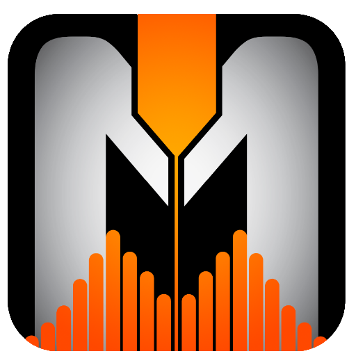
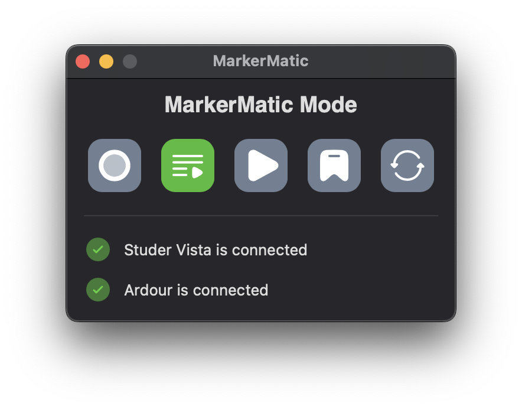

# MarkerMatic
A tool to automate cueing and marker placement between consoles and digital audio workstations (DAWs), primarily used for multitrack recordings. 
* [Project Website][website]
* [Latest Release][latest-release]

This project was previously known as Digico-Reaper Link, but has since grown to support five different families of consoles, and four different DAWs. Documentation and more can be found [on the project's website][website].

If you find MarkerMatic useful, please consider becoming a GitHub Sponsor or donating on Ko-fi:

 [][kofi]

[latest-release]: https://github.com/jms5194/Digico-Reaper-Link/releases/latest
[website]: https://markermatic.com/
[kofi]: https://ko-fi.com/justinstasiw